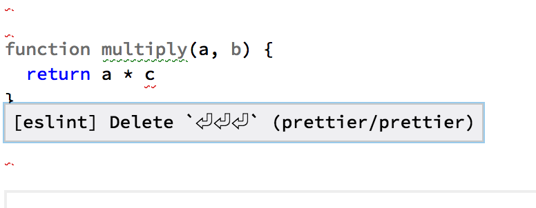

**Matheus Schettino** <br />

---

## Agenda

- Introdução ao Lint
- Introdução ao Eslint
- Como configurar
- Exemplos
- Plugins

---

### Introdução ao Lint

- Stephen C. Johnson, em 1978, durante desenvolvimento do YACC
- Programa que realiza uma análise léxica e sintática do programa
- Possibilita que o desenvolvedor foque em algoritmos e na corretude da aplicação
- Evolução dos compiladores incorporou funcionalidades de linters tradicionais
- No entanto, linters também evoluíram abordando outras áreas do desenvolvimento de software

---

### Lint em linguagens estaticamente tipadas

---

**O compilador tem poder para identificar erros**

```c
int multiply(int a, int b) {
  return a * "b";
}
```

---

**Erro de compilação**


---

**Versão correta**

```c
int multiply(int a, int b) {
  return a * b;
}
```

---

**Versão [ainda] correta**

```c
int multiply(int a, int b) {
  return a * b;
  a++;
}
```

---

**Lint em linguagem esticamente tipadas**

- Variáveis não utilizadas
- Código inalcançável
- Identificação de possível utilização de index de array fora dos limites
- Potenciais erros com utilização de ponteiros

---

> No entanto, um bom compilador já antecipa a grande parte dos problemas que podem ocorrer

---

> Em linguagens dinâmicamente tipadas, grande parte dos erros só são avaliados em tempo de execução.

---

**Lint em linguagem dinamicamente tipadas**

- Possibilitam execução do código antecipada para avaliação de erros
- Grande variedade de linters que garantem até mesmo checagem de tipos
- Atuam como compiladores para verificação do código
- Facilitam a eficiência do desenvolvimento com o ritmo esperado para aplicações em cima dessas linguagens

---

> Javascript

---

**Versão correta**

```js
function multiply(a, b) {
  return a * c;
}
```

---

# Eslint

---

- Criado em 2013 por Nicholas C. Zakas
- Possibilita a dectação de problemas em código JavaScript sem executá-lo
- Regras podem ser ativadas ou desativadas
- Não possui regras default
- Uma regra pode ser configurada para `warning` ou `error`
- Foco em extensão e plugins

---

**Integração com editores**

---

**Função _multiply_ com eslint desabilitado**


---


---


---



---

**Como configurar**

Pré requisito: nodejs e npm

```sh
 $ npm install -g eslint
```

---

**Onde configurar**

- .eslintrc
- campo `eslintConfig` no package.json

---

**Estrutura**

regra: nível de alerta [off, warn ou error]

---

### Exemplo de regra

**no-inner-declarations**

```javascript
// Good
function doSomething() {}

// Bad
if (test) {
  function doSomethingElse() {}
}
```

---

### Exemplo de regra

**no-global-assign**

```javascript
// Bad
undefined = 1;
window = {};
length = 1;
top = 1;

// Good
a = 1;
var b = 1;
b = 2;
```

---

### Exemplo de regra

**no-shadow**

```javascript
// Bad
if (true) {
  let a = 3;
  let b = 6;
}
let a = 5;
function b() {}

// Good
if (true) { let a = 3; }
let a = 5;
```

---

 **Exemplo Plugin: React**


---

<!-- REFERÊNCIAS -->

### Referências

- [Eslint docs](https://eslint.org/)
- [How to Use Lint for Static Code Analysis](https://barrgroup.com/Embedded-Systems/How-To/Lint-Static-Analysis-Tool)
- [Checking C Programs with Lint: C Programming Utility (Nutshell Handbooks)](https://www.amazon.com/Checking-Programs-Lint-Ian-Darwin/dp/0937175307/netrino)
- [Recommended Rules](https://github.com/eslint/eslint/blob/master/conf/eslint-recommended.js)
